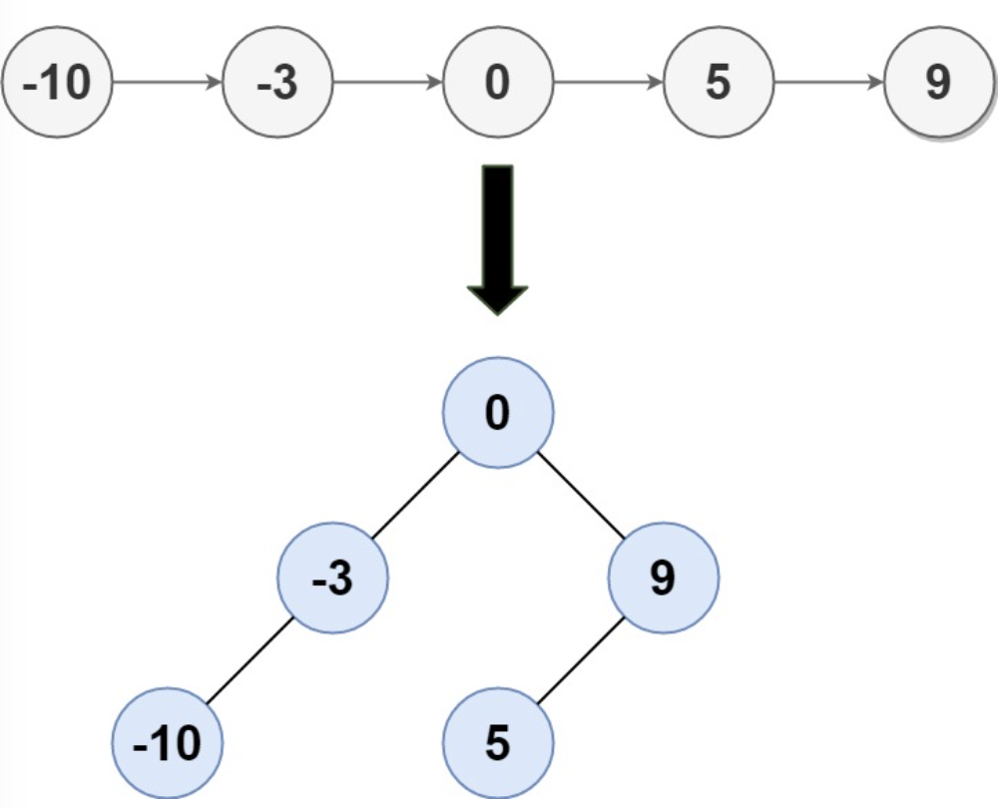

# leetcode - medium
# 109 Sorted Linked List to Height-Balanced BST 
Given the head of a singly linked list where elements are sorted in ascending order, convert it to a height-balanced binary search tree.

## Example
* Example 1:
  
    * Input: head = [-10,-3,0,5,9]
    * Output: [0,-3,9,-10,null,5]
    * Explanation: One possible answer is [0,-3,9,-10,null,5], which represents the shown height balanced BST.
* Example 2:
    * Input: head = []
    * Output: []

## Constraints:
The number of nodes in head is in the range [0, 2 * 104].
-105 <= Node.val <= 105

## Height-balanced binary tree
A **height-balanced binary tree** is defined as a binary tree in which the height of the left and the right subtree of any node differ by not more than 1. AVL tree, red-black tree are examples of height-balanced trees.

## Solution
* Find the midle node by "tortoise and hare" algorithm
* Construct left and right of each mid node by recursion